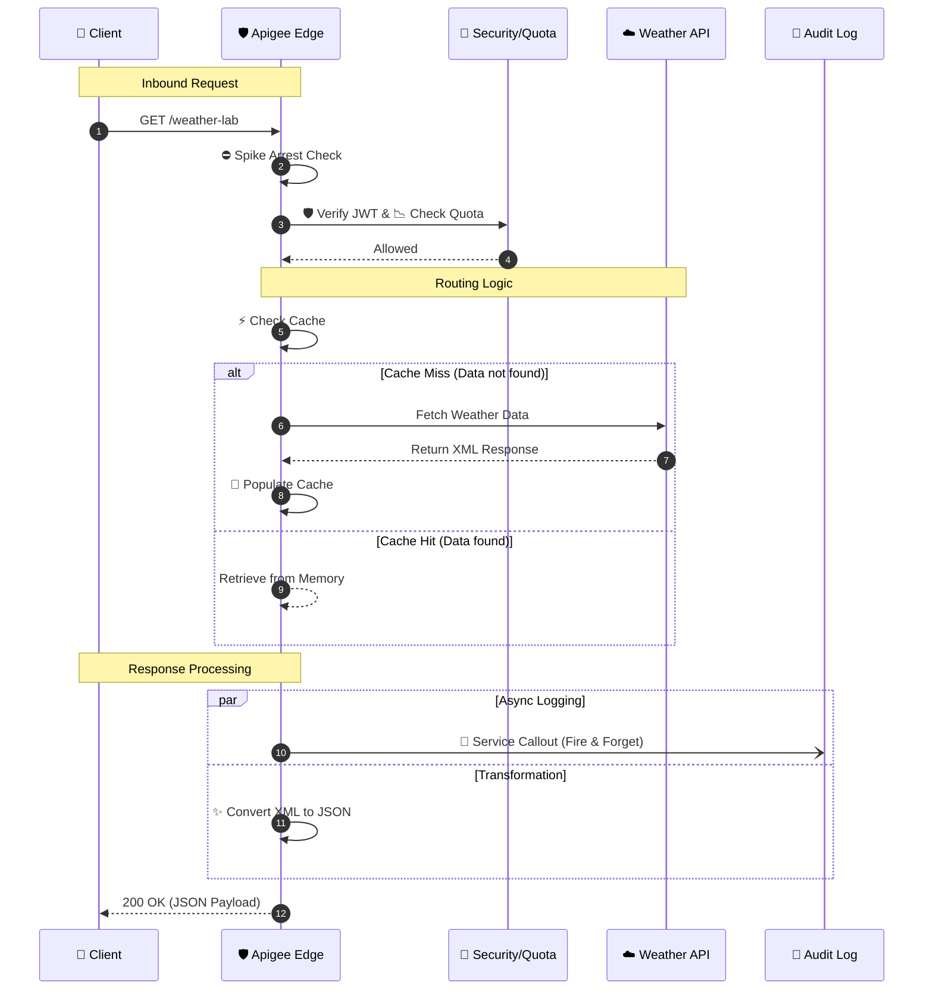
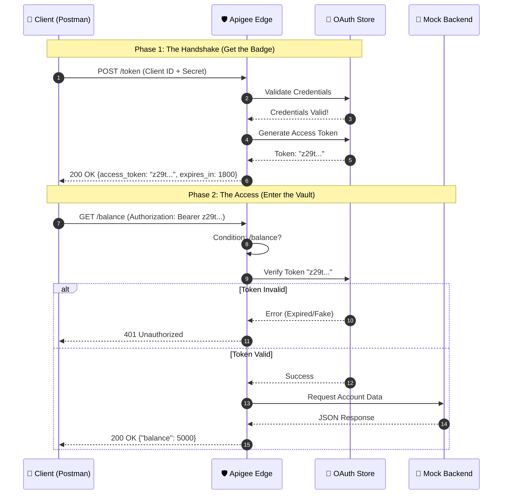
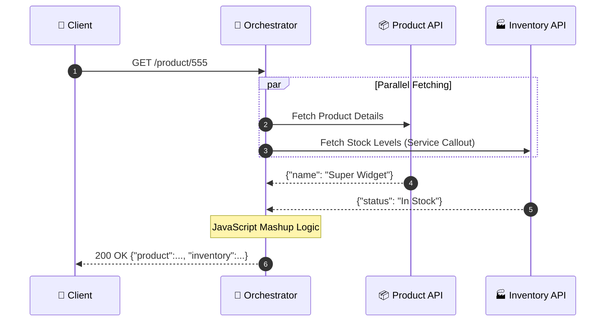
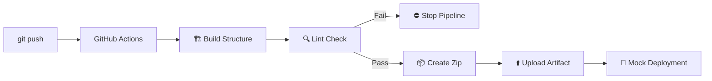
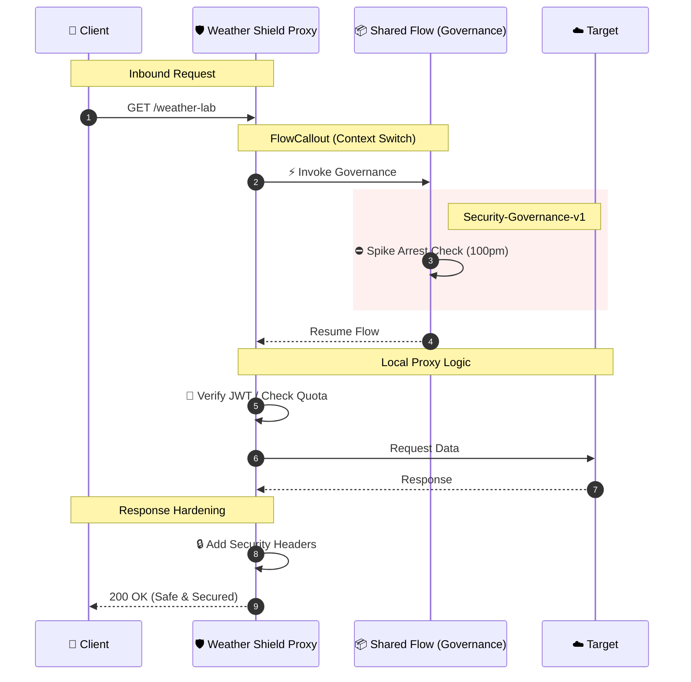

# 🧪 Apigee Innovation Lab

<p align="center">
  
  
  
  
  
</p>

Welcome to my **Digital Laboratory**.

This repository is a collection of hands-on, enterprise inspired projects built with **Google Cloud Apigee**. Each project focuses on a specific area of API management: security, OAuth 2.0, traffic control, API composition, shared governance, and CI/CD. The goal is practical, reusable patterns rather than isolated policy examples.

Whether you're learning Apigee, exploring enterprise API management, or reviewing my work, each project is fully documented with architecture diagrams, deployment guidance, and implementation notes.

## 🚀 Try the Lab (zero setup · free)

<p align="center">
  <a href="https://ssh.cloud.google.com/cloudshell/editor?cloudshell_git_repo=https://github.com/SunnyJayaRaju/Apigee-Lab.git">
    
  </a>
</p>

> One click opens the entire lab in your browser. It validates **all 5 projects** and prints a health report. No setup, no cost.

### ⚡ Quick Launch

| # | Project | What it demonstrates | Launch |
|---|---------|----------------------|--------|
| 1 | **Weather-Shield-Gateway** | JWT auth · Spike Arrest · Caching · Quotas | [](https://ssh.cloud.google.com/cloudshell/editor?cloudshell_git_repo=https://github.com/SunnyJayaRaju/Apigee-Lab.git&cloudshell_workspace=Weather-Shield-Gateway) |
| 2 | **Secure-Bank-Access** | OAuth 2.0 Client Credentials flow | [](https://ssh.cloud.google.com/cloudshell/editor?cloudshell_git_repo=https://github.com/SunnyJayaRaju/Apigee-Lab.git&cloudshell_workspace=Secure-Bank-Access) |
| 3 | **Retail-Mesh-Orchestrator** | API Composition · Service Callout · JS mashup | [](https://ssh.cloud.google.com/cloudshell/editor?cloudshell_git_repo=https://github.com/SunnyJayaRaju/Apigee-Lab.git&cloudshell_workspace=Retail-Mesh-Orchestrator) |
| 4 | **Apigee-DevOps-Pipeline** | CI/CD · apigeelint · GitHub Actions | [](https://ssh.cloud.google.com/cloudshell/editor?cloudshell_git_repo=https://github.com/SunnyJayaRaju/Apigee-Lab.git&cloudshell_workspace=Apigee-DevOps-Pipeline) |
| 5 | **Shared-Flows-Governance** | Shared Flows · FlowCallout · Governance | [](https://ssh.cloud.google.com/cloudshell/editor?cloudshell_git_repo=https://github.com/SunnyJayaRaju/Apigee-Lab.git&cloudshell_workspace=Shared-Flows-Governance) |

## 📑 Table of Contents

- [Project 1: Weather-Shield-Gateway](#-project-1-weather-shield-gateway)
- [Project 2: Secure-Bank-Access](#-project-2-secure-bank-access)
- [Project 3: Retail-Mesh-Orchestrator](#-project-3-retail-mesh-orchestrator)
- [Project 4: Apigee-DevOps-Pipeline](#-project-4-apigee-devops-pipeline)
- [Project 5: Shared-Flows-Governance](#-project-5-shared-flows-governance)
- [CI Pipeline & Tooling](#-ci-pipeline--tooling)

---

## 📂 Project 1: Weather-Shield-Gateway
**Status:** ✅ Actively Maintained | **Path:** `./Weather-Shield-Gateway`

A fully functional, enterprise-grade API Proxy that demonstrates the core pillars of API Management: Security, Mediation, and Monetization.

### 🛠 Tech Stack


### 📐 Architecture & Logic
The project structure follows a modular design pattern to separate concerns.

| Module | Folder | Function |
| :--- | :--- | :--- |
| **Contract** | `01-API-Design` | **OpenAPI 3.0 Spec** defining the API surface and data models. |
| **Mediation** | `02-Mediation` | **Transformation & Optimization:** JSON conversion and Caching logic. |
| **Security** | `03-Security` | **Protection:** Spike Arrests, JWT Validation, and API Key checks. |
| **Governance** | `04-Monetization` | **Rate Limiting:** Enforcing Quotas (Silver Tier) for monetization. |
| **Wiring** | `05-Proxy-Wiring` | **Orchestration:** Connecting policies into `PreFlow`, `PostFlow`, and `FaultRules`. |

### 🔄 Execution Flow
When a client request hits the **Weather Shield**:

1.  **Ingest:** Apigee intercepts the call to `/weather-lab`.
2.  **PreFlow (Security Layer):**
    * ⛔️ **Spike Arrest:** Blocks traffic surges immediately.
    * 🛡️ **JWT Auth:** Validates the security token.
    * 📉 **Quota:** Deducts credits from the user's tier.
    * ⚡️ **Cache Check:** Returns data instantly if available.
3.  **Target:** Forwards request to `api.example.com` (if not cached).
4.  **PostFlow (Mediation Layer):**
    * 💾 **Cache Populate:** Saves response for future calls.
    * 📡 **Audit Log:** Fires a background log to an external server.
    * ✨ **Transform:** Converts backend XML to clean JSON.
5.  **Response:** Client receives the final payload.


### 🧩 Visual Diagram: API Request Flow

The following diagram illustrates the request and response lifecycle for the `/weather-lab` endpoint managed by Google Cloud Apigee.

### 🌊 Flow Description of Visual Diagram

1.  **Request Pipeline (PreFlow):**
    * **Traffic Management:** The proxy first applies a **Spike Arrest** policy to protect against traffic surges.
    * **Security:** It validates the user's identity using **JWT Verification**.
    * **Quota Enforcement:** A **Quota** check ensures the client hasn't exceeded their API limits.
    * **Caching:** The system checks if a valid response already exists in the cache to reduce latency.

2.  **External Routing:**
    * If there is a **Cache Miss**, the request is routed to the backend **Weather API**.
    * If there is a **Cache Hit**, the backend call is bypassed.

3.  **Response Pipeline (PostFlow):**
    * **Cache Population:** Fresh responses from the backend are stored in the cache for future use.
    * **Logging:** An asynchronous **Service Callout** sends transaction details to the Audit Log Server without blocking the main response.
    * **Transformation:** Finally, the XML response from the backend is converted to **JSON** before being sent back to the client.

### 🎯 Key Concepts Demonstrated

- API Proxy Development
- JWT Authentication
- API Key Validation
- Traffic Management (Spike Arrest & Quota)
- Response Caching
- XML to JSON Transformation
- Service Callout Policy
- OpenAPI-First API Design

### ☁️ Deployment Guide

*This bundle is structured for Portfolio/Learning purposes. To deploy to Google Cloud Apigee X:*

1.  **Prepare the Artifact:**
    * Create a local folder named `apiproxy`.
    * Inside it, create folders: `proxies`, `targets`, `policies`.
    * **Copy** all XML policies from `02`, `03`, `04` into `policies/`.
    * **Copy** endpoints from `05` into `proxies/` and `targets/`.
    * **Copy** `weather-proxy.xml` to the root of `apiproxy/`.
    * **Zip** the `apiproxy` folder (Result: `apiproxy.zip`).

2.  **Upload to Cloud:**
    * Go to **Google Cloud Console → Apigee → API Proxies**.
    * Click **Create New** → **Upload Proxy Bundle**.
    * Select `apiproxy.zip`.

3.  **Deploy:**
    * Select the **eval** environment.
    * Click **Deploy**.

4.  **Verify:**
    * **Step 1:** Generate a test JWT at [jwt.io](https://jwt.io) using a temporary signing secret of your choice (for example, `demo-signing-secret`).
       * Security Note: This example uses a temporary secret for demonstration purposes only. In production Apigee deployments, signing secrets should never be hardcoded. Store them securely using services such as **Apigee KVM**, **Google Cloud Secret Manager**, or another approved secret management solution.
    * **Step 2 (Option A - Postman):**
        * Create a **GET** request to `https://[YOUR-URL]/weather-lab?city=London`.
        * Go to **Headers** tab.
        * Add Key: `Authorization`, Value: `Bearer <PASTE_YOUR_JWT>`.
        * Click **Send**.
    * **Step 2 (Option B - Terminal):**
        * Call the endpoint:
        ```bash
        curl -H "Authorization: Bearer <JWT>" "https://[YOUR-URL]/weather-lab?city=London"
        ```
---
## 📂 Project 2: Secure-Bank-Access
**Status:** ✅ Actively Maintained | **Path:** `./Secure-Bank-Access`

A simulation of a Banking API focused on **Identity & Access Management (IAM)**.
This project implements the **OAuth 2.0 Client Credentials** flow to secure sensitive financial data.

### 🛠 Tech Stack


### 📐 Architecture & Logic
This proxy uses **Conditional Flows** to handle two distinct operations in one endpoint.

| Module | Folder | Function |
| :--- | :--- | :--- |
| **Contract** | `01-API-Design` | **OpenAPI 3.0 Spec** defining `/token` and `/balance` paths. |
| **Security** | `03-Security` | **OAuthV2 Policies:** One for generating tokens, one for verifying them. |
| **Wiring** | `05-Proxy-Wiring` | **Flow Logic:** Routes traffic based on URL (`/token` vs `/balance`). |

### 🧩 Visual Diagram: OAuth 2.0 Flow

### 🌊 Flow Description

The architecture implements a standard **OAuth 2.0 Client Credentials Grant** pattern, separated into two distinct phases:

**Phase 1: The Handshake (Authentication)**
* **Trigger:** The Client `POST`s their Client ID and Secret to the `/token` endpoint.
* **Validation:** Apigee checks these credentials against its internal Identity Store.
* **Minting:** If valid, Apigee generates a cryptographically signed **Access Token** with a 30-minute expiration.
* **Response:** The client receives the token (the "Badge") to use for future requests.

**Phase 2: The Access (Authorization)**
* **Gatekeeping:** The Client makes a `GET` request to the protected `/balance` endpoint, attaching the token in the `Authorization: Bearer` header.
* **Verification:** The Proxy intercepts the request *before* it reaches the backend. It checks:
    1.  Is the token signature valid?
    2.  Has the token expired?
    3.  Is the token revoked?
* **Routing:**
    * ⛔️ **Invalid:** The proxy returns `401 Unauthorized` immediately. The backend is never touched.
    * ✅ **Valid:** The proxy forwards the request to the Banking Backend to retrieve account data.

### 🎯 Key Concepts Demonstrated

- OAuth 2.0 Client Credentials Grant
- Access Token Generation
- Access Token Verification
- Conditional Flow Routing
- Protected API Endpoints
- Authentication vs Authorization

### ☁️ Deployment Guide

*This bundle relies on Apigee's internal identity store (App/Product/Developer).*

1.  **Deploy the Proxy:**
    * Create a local folder named `apiproxy`.
    * Inside it, create folders: `proxies`, `targets`, `policies`.
    * **Copy** all XML policies from `03-Security` into `policies/`.
    * **Copy** endpoints from `05-Proxy-Wiring` into `proxies/` and `targets/`.
    * **Copy** `bank-proxy.xml` to the root of `apiproxy/`.
    * **Zip** the `apiproxy` folder.
    * Upload to **Google Cloud Console** and deploy to `eval`.

2.  **Configure Infrastructure:**
    * **API Product:** Create a Product named "Banking-Premium" (Access: Public, Scopes: All).
    * **Developer:** Create a dummy developer (e.g., `fintech@example.com`).
    * **App:** Create an App, select the Developer, and add the "Banking-Premium" Product.
    * **Keys:** Copy the generated **Client ID** and **Client Secret**.

3.  **Verify:**
    * **Get Token:** POST your ID/Secret to `https://[YOUR-URL]/bank-v1/token`.
    * **Access Data:** Use the returned token to GET `https://[YOUR-URL]/bank-v1/balance`.
---
## 📂 Project 3: Retail-Mesh-Orchestrator
**Status:** ✅  Actively Maintained | **Path:** `./Retail-Mesh-Orchestrator`

An advanced **API Composition** project.
Instead of simply proxying traffic, this API acts as an **Orchestrator**, making parallel calls to multiple backends and merging the data using JavaScript logic before responding to the client.

### 🛠 Tech Stack


### 📐 Architecture & Logic
This proxy implements the **API Composition Pattern** (sometimes called "Backend for Frontend").

| Module | Folder | Function |
| :--- | :--- | :--- |
| **Contract** | `01-API-Design` | **OpenAPI 3.0 Spec** for composite product data. |
| **Mediation** | `02-Mediation` | **Service Callout:** Fetches inventory. **JavaScript:** Merges JSON. |
| **Wiring** | `05-Proxy-Wiring` | **Flow Logic:** Orchestrates the sequence of calls. |

### 🧩 Visual Diagram: API Composition Flow

### 🌊 Flow Description

1.  **Request Ingest:** The client requests a composite resource (`/product/555`).
2.  **Main Target:** The proxy forwards the request to the **Product Catalog** to get descriptions and pricing.
3.  **Side Request (Service Callout):** *While* the main request is happening (or immediately after), the proxy makes a separate HTTP call to the **Inventory Service** to check stock levels.
4.  **Data Holding:** Both responses are stored in flow variables (`response.content` and `inventoryResponse`).
5.  **The Mashup (JavaScript):** A custom JS script executes to:
    * Parse both JSON payloads.
    * Extract relevant fields.
    * Construct a new, unified JSON object.
6.  **Final Response:** The composite object is returned to the client.

### 🎯 Key Concepts Demonstrated

- API Composition Pattern
- Service Callout Policy
- JavaScript Response Mediation
- Backend Service Orchestration
- Composite API Design
- Data Aggregation

### ☁️ Deployment Guide
*Requires special folder structure for scripts.*

1.  **Build:**
    * Create a local `apiproxy` folder structure.
    * **Crucial Step:** Place `Mashup-Logic.js` inside `apiproxy/resources/jsc/`.
    * Place all other XML policies in `apiproxy/policies/`.
    * Zip the folder.

2.  **Deploy:** Upload to **Google Cloud Apigee** and deploy to `eval`.

3.  **Verify:**
    * `GET https://[YOUR-URL]/retail-v1/product/555`
    * **Expected Result:** A merged JSON response containing both Product and Inventory data.
---
## 📂 Project 4: Apigee-DevOps-Pipeline
**Status:** ✅ Actively Maintained (CI Phase) | **Path:** `./Apigee-DevOps-Pipeline`

A demonstration of **Automated Continuous Integration (CI)**.
This project moves away from manual console deployments. It uses **GitHub Actions** to automatically lint, bundle, and package the proxy whenever code is pushed to the repository.

### 🛠 Tech Stack


### 📐 Architecture & Logic
The pipeline creates a "Quality Gate" that prevents bad code from reaching production.

| Stage | Action | Function |
| :--- | :--- | :--- |
| **1. Build** | `mkdir` & `cp` | **Standardization:** Converts the raw repo structure into a valid `apiproxy` bundle. |
| **2. Lint** | `apigeelint` | **Static Analysis:** Scans XML and JS files for syntax errors and best practice violations. |
| **3. Package** | `zip` | **Artifact Creation:** Compresses the validated code into a deployable `apiproxy.zip` file. |
| **4. Simulation** | `echo` | **CD Mock:** Simulates the cloud handshake (Deployment is currently manual due to env constraints). |

### 🧩 Visual Diagram: CI/CD Pipeline

### 🌊 Flow Description
The pipeline automates the software delivery lifecycle in three distinct phases:

**Phase 1: Trigger & Setup**
* **Event:** A developer pushes code to the `main` branch.
* **Initialization:** GitHub Actions provisions a fresh GitHub-hosted runner and installs the necessary runtime (Node.js) to execute the workflow.

**Phase 2: The Quality Gate (CI)**
* **Build:** The system dynamically assembles the `apiproxy` folder structure from the source files.
* **Linting:** The `apigeelint` tool performs a deep scan of the XML configuration.
    * ⛔️ **Failure:** If syntax errors or anti-patterns are found, the pipeline halts immediately, preventing broken code from progressing.
    * ✅ **Success:** If the code is clean, the pipeline proceeds to packaging.

**Phase 3: Delivery (Artifacts)**
* **Packaging:** The validated bundle is compressed into a standard `apiproxy.zip` file.
* **Artifact Upload:** This zip file is uploaded to GitHub Storage, allowing the developer to download the "Ready-to-Deploy" bundle.
* **Simulation:** The workflow concludes by simulating the final handoff to Google Cloud (Deployment).

### 🎯 Key Concepts Demonstrated

- CI/CD Pipeline Fundamentals
- GitHub Actions Workflow
- Automated Quality Gates
- Static Analysis with apigeelint
- Build Artifact Packaging
- Continuous Integration for Apigee

### ☁️ Deployment Guide
*This pipeline automates the Build and Verify stages.*

1.  **Push Code:**
    * Commit your changes and push to `main`.
    * `git push origin main`

2.  **Monitor Pipeline:**
    * Go to the **Actions** tab in GitHub.
    * Click on the latest workflow run.
    * Verify all steps have **Green Checkmarks** ✅.

3.  **Download Artifact:**
    * Scroll to the "Artifacts" section of the workflow summary.
    * Download **deployable-bundle**.
    * This zip file is verified and ready for manual upload to Google Cloud Apigee if needed.
---
## 📂 Project 5: Shared-Flows-Governance
**Status:** ✅ Actively Maintained | **Path:** `./Shared-Flows-Governance/Security-Governance-v1`

A **Shared Flow** module designed to centralize security logic.
Instead of duplicating policies across every proxy, this module is built once and referenced by multiple proxies using the `FlowCallout` policy, ensuring consistent governance across the organization.

### 🛠 Tech Stack


### 📐 Architecture & Logic
This project separates global governance from local proxy logic.

| Module | Folder | Function |
| :--- | :--- | :--- |
| **Shared Bundle** | `Security-Governance-v1` | **Global Logic:** Contains the Spike Arrest policy (`SA-Standard-Limit`). |
| **Proxy Bundle** | `Weather-Shield-Gateway` | **Local Implementation:** Calls the shared logic via `FlowCallout` in the PreFlow. |
| **Response Logic** | `PostFlow` | **Hardening:** Security Headers and Response personalization happen here. |

### 🔄 Execution Flow
1.  **Request:** Client calls the Proxy.
2.  **FlowCallout:** The Proxy pauses and executes the **Shared Flow**.
3.  **Governance:** The Shared Flow applies the **Spike Arrest**.
4.  **Resume:** If successful, control returns to the Proxy to handle Authentication and Caching.

### 🧩 Visual Diagram: Shared Flow Execution

### 🌊 Flow Description

The architecture implements a **Governance-First** approach, ensuring that global security standards are applied before any local proxy logic runs.

1.  **Governance Hook (PreFlow):**
    * **Delegation:** Upon receiving a request, the `Weather-Shield-Gateway` immediately suspends its own logic and invokes the `FC-Invoke-Governance` policy.
    * **Context Switch:** Control is passed to the **Shared Flow Bundle** (`Security-Governance-v1`).
    * **Global Enforcement:** The Shared Flow executes the **Spike Arrest** policy (100 requests/minute). This protects the entire platform from DDoS attacks, regardless of the individual proxy's configuration.

2.  **Local Execution:**
    * If the request passes the Spike Arrest, control returns to the main proxy.
    * The proxy then proceeds with its specific security chain: **Verify JWT** (Identity) and **Check Quota** (Monetization).

3.  **Response Hardening (PostFlow):**
    * **Personalization:** Before responding, the proxy overwrites the generic backend message ("Hello, Guest") with the user's name extracted from the JWT.
    * **Security Headers:** The `AM-Set-Security-Headers` policy injects critical HTTP headers (`Strict-Transport-Security`, `X-Frame-Options`) to protect the client against clickjacking and sniffing attacks.

### 🎯 Key Concepts Demonstrated

- Shared Flow Reusability
- FlowCallout Policy
- Centralized API Governance
- Cross-Proxy Security Enforcement
- Platform-Wide Policy Management
- Security Header Hardening

### ☁️ Deployment Guide

*This project requires deploying two separate artifacts: the Shared Flow first, then the Proxy.*

1.  **Deploy the Shared Flow:**
    * Create a folder `sharedflowbundle`.
    * Inside `sharedflowbundle/policies/`, add `SA-Standard-Limit.xml`.
    * Inside `sharedflowbundle/sharedflows/`, add `default.xml` (referencing the policy).
    * **Zip** the `sharedflowbundle` folder.
    * Go to **Apigee > Develop > Shared Flows**.
    * Upload and **Deploy** to `eval`.

2.  **Configure the Proxy:**
    * Open your `Weather-Shield-Gateway` proxy bundle.
    * **Add Policy:** Create a `FlowCallout` policy named `FC-Invoke-Governance` that references `security-governance-v1`.
    * **Add Policy:** Create `AM-Set-Security-Headers` and `AM-Set-Personalized-Response`.
    * **Wiring:**
        * Attach `FC-Invoke-Governance` to the **Request PreFlow** (Step 1).
        * Attach `AM-Set-Security-Headers` and `AM-Set-Personalized-Response` to the **Response PostFlow**.
    * **Deploy** the updated proxy to `eval`.

3.  **Verify:**
    * **Test 1 (Governance):** Click "Send" in Postman rapidly (3+ times/sec). You should receive a **429 Too Many Requests** error.
    * **Test 2 (Headers):** Send a valid request. Check the **Headers** tab in Postman for `Strict-Transport-Security` and `X-Frame-Options`.
    * **Test 3 (Identity):** Ensure the JSON body responds with `"message": "Hello, [your-subject]!"` instead of "Guest".

---
## 🔧 CI Pipeline & Tooling

Every push and PR runs **[Apigee Proxy CI](.github/workflows/apigee-ci.yml)**, which validates all **six deployable artifacts** (5 API proxies + 1 shared flow bundle):

| Check | What it does |
|---|---|
| XML validation | `xmllint` on every policy/proxy file across all 5 projects |
| OpenAPI sanity | Specs must declare an `openapi:` root key |
| Drift guard | Fails if governance mirror policies diverge from canonical sources |
| `apigeelint` | Version-pinned (`2.85.1`) lint of every assembled bundle |
| Secret scan | gitleaks over full history |
| Packaging | Deployable `.zip` artifacts uploaded every run |

**Policy single-source-of-truth rule:** shared policies are edited ONLY in the design-time project folders (`Weather-Shield-Gateway/02..04-*`). The copies inside `Shared-Flows-Governance/Weather-Shield-Gateway/policies/` are mirrors.

```bash
./tools/check-drift.sh                # verify mirrors match canonical (CI runs this)
./tools/sync-governance-policies.sh   # re-mirror after editing a shared policy
./tools/build-bundles.sh target       # assemble deployable bundles locally
```

> ℹ️ No live Apigee org is attached — bundles are validated and packaged, ready to upload by hand or wire to an eval org later (see the *Deployment Readiness* job output in any CI run).

---

## 🎓 Conclusion

This repository represents a practical exploration of Google Cloud Apigee through progressively advanced projects. Each project focuses on a different aspect of enterprise API Management, from building secure API proxies to implementing reusable governance and automated delivery pipelines.

The goal of **Apigee Innovation Lab** is to provide practical, well-documented examples that demonstrate how enterprise API platforms are designed, secured, managed, and delivered in real-world environments.

---

## 👨‍💻 Author

**Sunny JayaRaju**

API Engineer | Google Cloud Apigee | API Security | API Management

If you found this repository useful, feel free to explore the projects, provide feedback, or connect with me on GitHub.

GitHub: https://github.com/SunnyJayaRaju
